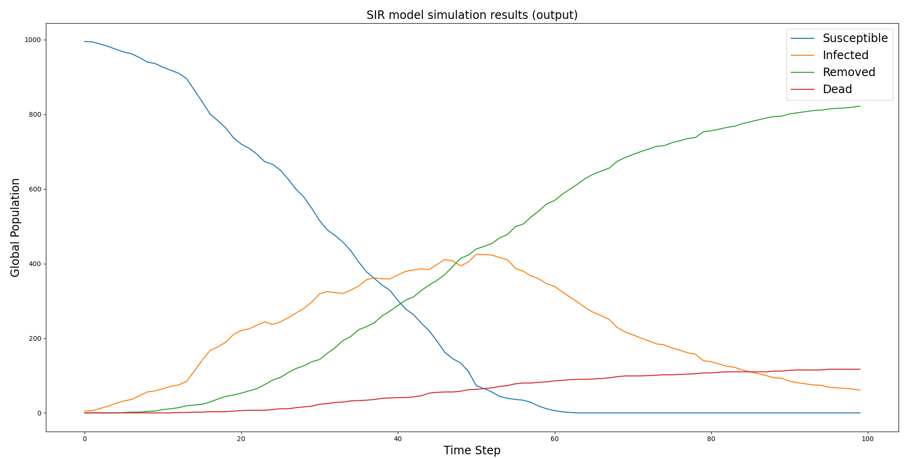

# :syringe: FPMAS Virus Model

An [FPMAS](https://github.com/FPMAS/FPMAS) implementation of the classical [SIR
epidemiological
model](https://en.wikipedia.org/wiki/Compartmental_models_in_epidemiology#The_SIR_model_2).
An agent behavior for one time step can be described as follows:
1. Propagate infection to agents in the Moore neighborhood. Each agent has a
   probability _infection_rate_ to infect other agents.
2. If infected, recover with a probability _recover_rate_.
3. If still infected, die with a probability _mortality_rate_.
4. If alive, move to a random cell in the Moore neighborhood.

Compared to the classical SIR notations:
- _recover_rate_ is equivalent to _gamma_.
- _infection_rate_ is equivalent to _beta_ / _contact_count_. In this
  Multi-Agent System model, the average contact count can't be controlled
  directly, since it is determined at each time step by the size of the grid
  and the agent counts.
- _mortality_rate_ is equivalent to _mu_.


The execution scheme is such as agents independently execute the 4 behaviors in
a row, and a global synchronization is applied only when all agents have
executed all the behaviors, marking the end of the current time step. How the
infection propagates might depend on the selected infection and synchronization
modes.


## Build

Ensures that the [FPMAS](https://github.com/FPMAS/FPMAS) platform is properly
installed. An additional `-DCMAKE_PREFIX_PATH=custom/installation/path/` might
be specified to `cmake` if `FPMAS` is not installed in a standard directory
(the installation path corresponds to the `-DCMAKE_INSTALL_PREFIX` eventually
specified when building `FPMAS`).

```
git clone https://github.com/FPMAS/fpmas-virus
cd fpmas-virus
mkdir build
cd build
cmake -DCMAKE_BUILD_TYPE=Release ..
make
```

## Configuration

Model parameters are described in the [config.yml](blob/master/config.yml)
file. Here we focus on the `infection_mode` and `sync_mode` parameters.
- `infection_mode`: Defines the infection behavior
  - `WRITE`: each infected agent _acquires_ its neighbors and infect them with
	a probability _infection_rate_. Only works with the `HARD_SYNC` mode.
  - `READ`: read only infection. Each agent performs `N` Bernoulli experiments
	of parameter _infection_rate_, where `N` it the count of `INFECTED` agents
	in its neighborhood: if at least one experiment succeeds, the agent gets
	`INFECTED`. Works with `HARD_SYNC`, `GHOST` and `GLOBAL_GHOST`
	synchronizations.
- `sync_mode`: Synchronization mode used to perform read/write operations.
  - `HARD_SYNC`: strongest synchronization, all read/acquire are performed on
	the fly, during the time step, even across processes. Each run is not
	reproducible.
  - `GHOST`: only `distant` agents are read from a _ghost_ copy updated at each
	time step. Reproducible between executions, but dependent on the process
	count.
  - `GLOBAL_GHOST`: all agents, `distant` and `local`, are read from a _ghost_
	copy. All runs are reproducible, independently of the process count.

## Run

The model can be run with the following command:

```
mpiexec -n <N> ./fpmas-virus <config_file> [-s seed]
```
- `N`: processes count
- `config_file`: a `.yml` configuration file
- `seed` (optional): a random seed

The `./seed N` utility command can also be used to deterministically generate a
set of `N` seeds that can be passed to the model.

## Output

The generated `output.csv` file contains the following fields:

| T    | S             | I          | R           | D      |
|------|---------------|------------|-------------|--------|
| Time | `SUSCEPTIBLE` | `INFECTED` | `RECOVERED` | `DEAD` |

## Analysis

Python script used to plot results is not provided in this repository any more,
as it was heavily dependent on the experimental context. Here is however an
example plot that can be obtained from the CSV output of a model simulated with
the default [config.yml](blob/master/config.yml) file and the default seed:


# Contact

For more information about this model or its implementation, please contact:
- Paul Breugnot (developer): paul.breugnot@univ-fcomte.fr
- Laurent Philippe (supervisor): laurent.philippe@univ-fcomte.fr
- Bénédicte Herrmann (supervisor): benedicte.herrmann@univ-fcomte.fr
- Christophe Lang (supervisor): christophe.lang@univ-fcomte.fr
